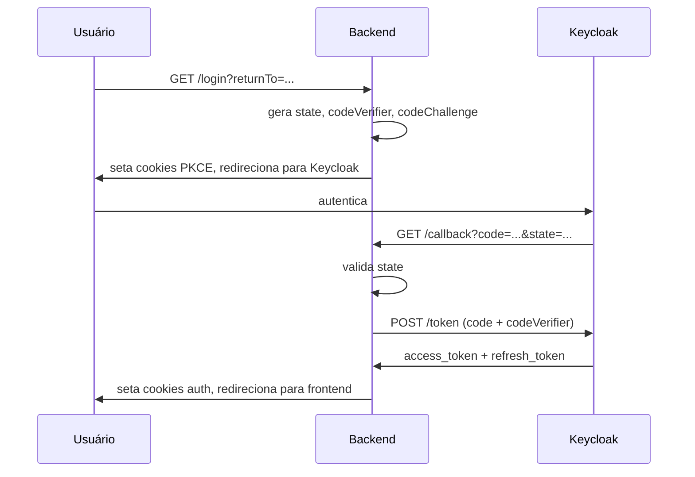

# Keycloak — Fluxo PKCE

## Contexto

Implementado em `PkceService` (`src/modules/auth/services/pkce.service.ts`). Responsável pela geração dos parâmetros PKCE e pela validação do callback.

## Conteúdo principal

### `buildRedirectAuthUrl(returnParams?)`

Gera os artefatos de segurança e monta a URL de redirecionamento para o Keycloak.

```
state = base64url( JSON.stringify({ csrf: randomBytes(16).hex, returnParams }) )
codeVerifier = randomBytes(32).base64url
codeChallenge = SHA-256(codeVerifier).base64url
```

Parâmetros enviados ao Keycloak:

| Parâmetro | Valor |
|---|---|
| `client_id` | `env.oauth.clientId` |
| `response_type` | `code` |
| `redirect_uri` | `env.oauth.redirectUri` |
| `scope` | `openid email profile` |
| `state` | state gerado |
| `code_challenge` | SHA-256 do codeVerifier |
| `code_challenge_method` | `S256` |

URL final: `${env.oauth.baseUrl}/auth?<params>`

### `handleCallback(input)`

Valida e processa o retorno do Keycloak.

**Validações:**
1. `savedState !== state` → lança `UnauthorizedException('State inválido - possível ataque CSRF')`
2. `codeVerifier` ausente → lança `UnauthorizedException('Code verifier não encontrado')`

**Processamento:**
1. Chama `KeycloakClient.exchangeCodeForToken(code, codeVerifier)`
2. Decodifica o `access_token` para log de debug (`realm_access.roles`)
3. Decodifica o `state` para extrair `returnParams`
4. Retorna `{ accessToken, refreshToken, returnParams }`

### Diagrama do fluxo



## Relacionados

- [[02-infrastructure/auth/keycloak/keycloak_index]] — Índice do serviço Keycloak
